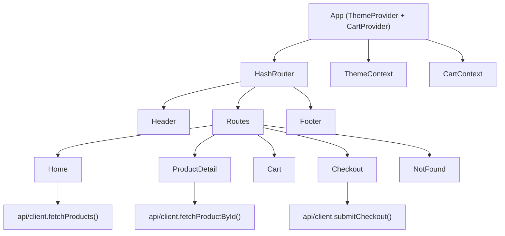

# Architecture Overview

## High-Level Frontend Architecture

The Fresh Fruit Market application is a single-page React app built with Create React App. It uses React Router v6 with HashRouter to support static hosting. Cross-cutting concerns are implemented via React Contexts:

- ThemeContext (src/contexts/ThemeContext.js): manages light/dark theme, applies the data-theme attribute, and persists the setting to localStorage.
- CartContext (src/contexts/CartContext.js): manages cart items and operations, computes derived totals (subtotal, tax, shipping, total), and persists to localStorage.

All data access flows through a minimal API client that reads environment variables for the API base URL and gracefully falls back to mock data.

## Application Shell

- App.js wraps the entire app in ThemeProvider and CartProvider.
- HashRouter provides routes for Home, ProductDetail, Cart, Checkout, and NotFound.
- Header and Footer render on all routes, with a retro divider for visual separation.

Container structure at runtime:
- ThemeProvider: exposes theme state and toggle action.
- CartProvider: exposes cart state, actions, and derived totals.
- Router: defines and renders pages.

## Component Organization

- src/components:
  - Header: branding, theme toggle, cart badge.
  - Footer: links and contact.
  - ProductCard: product tile with add-to-cart.
  - Loading: accessible loading indicator.
- src/pages:
  - Home: product list with search-like filtering.
  - ProductDetail: details with quantity selection and add-to-cart.
  - Cart: editable cart with summary and navigation to checkout.
  - Checkout: simple form that posts to the API layer (real or mock).
  - NotFound: fallback page.
- src/api:
  - client.js: base URL resolution and API calls with timeout + mock fallback.

## State Management Approach

- ThemeContext:
  - State: theme ("light" | "dark")
  - Actions: setTheme, toggleTheme()
  - Persistence: localStorage key "ffm_theme"
  - Integration: sets documentElement data-theme to drive CSS variables
- CartContext:
  - State: items[] with { id, name, price, qty, ... }
  - Actions: addItem(product, qty), updateQty(id, qty), removeItem(id), clear()
  - Derived: subtotal (rounded), tax (7%), shipping (free if subtotal > $25 or 0), total
  - Persistence: localStorage key "ffm_cart"

## Routing

React Router v6 with HashRouter for static hosting compatibility:

- / — Home
- /product/:id — Product details
- /cart — Cart
- /checkout — Checkout
- * — NotFound

## Data Access and Future Backend Interface

API client (src/api/client.js):

- Base URL resolution precedence:
  1) REACT_APP_API_BASE
  2) REACT_APP_BACKEND_URL
  3) REACT_APP_FRONTEND_URL
- fetchWithTimeout uses AbortController to avoid indefinite requests.
- Public methods:
  - fetchProducts(): GET /products
  - fetchProductById(id): GET /products/:id
  - submitCheckout(payload): POST /checkout
- Fallback behavior:
  - If base URL is missing or requests fail, return mock product lists and a mock checkout confirmation.

Future backend integration:
- Replace mock fallbacks by ensuring a valid API base and production-grade endpoints.
- Consider authentication headers and error handling patterns.
- Extend the client with additional endpoints (filters, categories, search suggestions).

## Container Description

FreshFruitMarketFrontend (React, web):
- Provides the complete UI for browsing, searching, and purchasing fruits.
- Manages application state and UX concerns entirely in the frontend.
- Designed to be extensible for adding backend APIs or payment processing later.

## Diagram

## Error Handling and Resilience

- API requests have timeouts and robust mock fallbacks.
- Theme and cart states persist across reloads.
