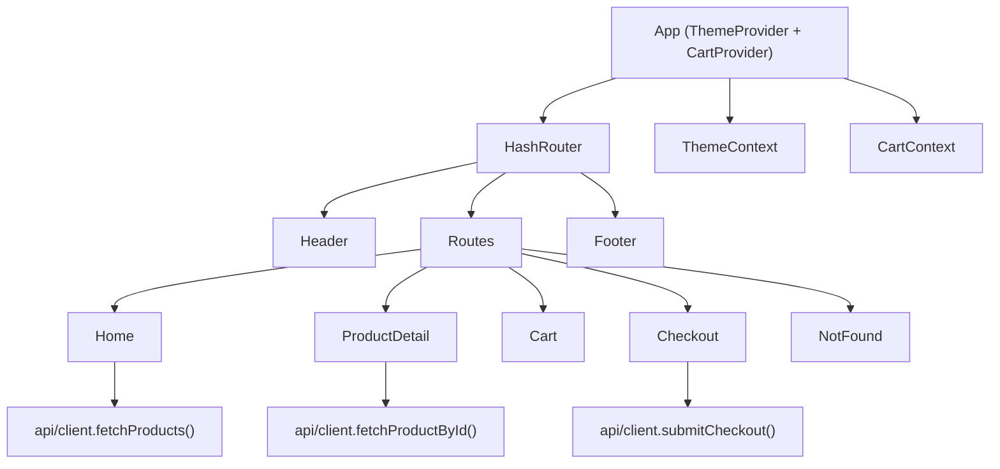

# Fresh Fruit Market — React Frontend

A React web frontend for an online fruit shop that lets users browse, search, and purchase fruits. The UI follows a modern, minimalist style with a subtle retro touch, aligned to the Ocean Professional palette (blue primary with amber accents). This repository currently contains only the frontend; a backend/API will be added later.

## Project Purpose and Scope

The goal of this frontend is to provide a delightful shopping experience for fresh fruits. Users can:
- Browse a curated catalog of fruits.
- Search and filter by name, description, or category.
- View product details and select quantities.
- Add items to a cart and proceed through a checkout flow.

This codebase is limited to the web UI. Network calls are abstracted via an API client that supports environment-driven base URLs and a robust mock fallback to allow local development without a backend.

## Current State and Roadmap

Current capabilities:
- Client-side routing via HashRouter.
- Theming with light/dark modes (persisted in localStorage).
- Cart management with derived totals and persistence.
- Product list, details, cart, and checkout pages.
- API client that reads env variables and falls back to mock data when not configured or failing.

Planned next steps:
- Integrate a real backend using RESTful endpoints for products and checkout.
- Expand test coverage for components, contexts, and API client.
- Add product images/assets and refine accessibility labels.

## Architecture Overview

The app is a single-page React application structured around a small set of pages and shared components. Context providers manage cross-cutting concerns like theme and cart state, and HashRouter handles navigation.

- App shell and routing:
  - App.js: mounts ThemeProvider and CartProvider, sets up HashRouter, and renders a shared Header and Footer around page routes.
  - Routes include Home, ProductDetail, Cart, Checkout, and NotFound.

- State management:
  - ThemeContext.js: manages the current theme and persists it to localStorage. Applies data-theme on the documentElement to drive CSS variables in App.css.
  - CartContext.js: manages cart items and provides operations (add, update quantity, remove, clear). Computes derived values (subtotal, tax, shipping, total) and persists items to localStorage.

- Data access:
  - api/client.js: reads REACT_APP_API_BASE (preferred) or REACT_APP_BACKEND_URL/REACT_APP_FRONTEND_URL to compute the base URL. Provides:
    - fetchProducts
    - fetchProductById
    - submitCheckout
    Each function gracefully falls back to mock data when the backend is not configured or errors occur. A timeout helper aborts slow requests.

- Components:
  - Header.js: branding, theme toggle, and cart badge with item count.
  - Footer.js: minimal links and contact.
  - ProductCard.js: product summary with add-to-cart.
  - Loading.js: accessible loading indicator.

- Pages:
  - Home.js: fetches products, provides client-side search, and displays a responsive product grid.
  - ProductDetail.js: fetches a specific product, supports quantity selection, and add-to-cart.
  - Cart.js: shows cart items with quantity controls and a summary pane.
  - Checkout.js: simple form, posts to backend when available or returns a mock confirmation, then clears the cart.
  - NotFound.js: fallback route.

### Diagram



## Local Development Workflow

- Install dependencies and start the development server:
  - npm install
  - npm start
- The preview auto-starts on port 3000. Do not manually start additional processes in this environment; rely on the provided preview system.

Scripts:
- npm start — start the CRA dev server (react-scripts)
- npm test — run tests once (watchAll=false)
- npm run build — production build

Linting:
- ESLint configuration exists (eslint.config.mjs) with React plugin and basic rules (e.g., no-unused-vars with React/App ignore).

## Preview System Notes

A preview is automatically served on port 3000 under the container name fruit_shop_frontend. Do not spawn manual servers or change ports unless necessary. If you need to adjust the port for a different environment, use REACT_APP_PORT and ensure hosting accommodates it.

## Environment Configuration

The app reads environment variables at build time (Create React App style). The API client uses the following variables in this precedence:
1) REACT_APP_API_BASE (preferred)
2) REACT_APP_BACKEND_URL
3) REACT_APP_FRONTEND_URL

Additional variables are included for broader environment control and future expansion.

Required/recognized variables:
- REACT_APP_API_BASE: Base URL for API calls, e.g., https://api.example.com
- REACT_APP_BACKEND_URL: Alternative API base
- REACT_APP_FRONTEND_URL: Alternative API base (legacy)
- REACT_APP_WS_URL: Reserved for future real-time features
- REACT_APP_NODE_ENV: Node environment string
- REACT_APP_NEXT_TELEMETRY_DISABLED: Disable telemetry if applicable
- REACT_APP_ENABLE_SOURCE_MAPS: Toggle source maps
- REACT_APP_PORT: Port to run the dev server (default 3000 in CRA)
- REACT_APP_TRUST_PROXY: Proxy trust toggle for advanced setups
- REACT_APP_LOG_LEVEL: Client log level
- REACT_APP_HEALTHCHECK_PATH: Path for health checks (future)
- REACT_APP_FEATURE_FLAGS: JSON string or CSV toggles for experimental features
- REACT_APP_EXPERIMENTS_ENABLED: Enable experiments (true/false)

Example .env:
```
REACT_APP_API_BASE=https://api.example.com
REACT_APP_WS_URL=wss://ws.example.com
REACT_APP_NODE_ENV=development
REACT_APP_ENABLE_SOURCE_MAPS=true
REACT_APP_PORT=3000
REACT_APP_LOG_LEVEL=info
REACT_APP_FEATURE_FLAGS=betaFilters,perfHints
REACT_APP_EXPERIMENTS_ENABLED=false
```

Notes:
- If no API base is configured or the backend is unreachable, the app falls back to mock data for products and checkout, ensuring local flows remain functional.

## Theming and Styling Guidance

The Ocean Professional palette is implemented with CSS variables in src/App.css:
- Primary: #2563EB
- Secondary/Success: #F59E0B
- Error: #EF4444
- Background: #f9fafb
- Surface: #ffffff
- Text: #111827

Design guidance:
- Modern, clean aesthetic with subtle shadows, rounded corners, minimal ornamentation.
- Accent highlights on interactive elements; smooth transitions and subtle gradients for depth.
- Retro accents appear as subtle repeating gradients for dividers and hero/tiles.
- Dark mode is supported via data-theme="dark" CSS variables in App.css.

Usage:
- Prefer CSS variables for colors and text.
- Use semantic HTML and clear focus outlines for accessibility.
- Ensure sufficient color contrast (check WCAG AA/AAA where possible).

## Accessibility and Performance

Accessibility:
- Use semantic elements, aria-labels for interactive controls, and aria-live on loading states.
- Maintain visible focus states (already defined in App.css).
- Provide text alternatives for decorative imagery (current UI uses emojis and gradients as placeholders).

Performance:
- Keep component structures lean and avoid unnecessary re-renders (contexts useMemo for derived values).
- Prefer CSS for visual effects; leverage browser caching and production builds for deployment.
- Timeouts and graceful fallbacks prevent long hangs when the backend is unavailable.

## Testing Strategy (Initial)

- Unit tests with react-scripts and testing-library (@testing-library/react, jest-dom).
- Current test: src/App.test.js validates the presence of the header title.
- Future additions:
  - Component tests for pages and components (Home, ProductDetail, Cart, Checkout, ProductCard).
  - Integration tests for cart operations and checkout workflow.
  - API client tests using mock fetch and timeout scenarios.

Run tests:
- npm test

## Deployment Considerations

- This is a static React app built with Create React App.
- Use npm run build to produce optimized assets under build/.
- HashRouter is used to support client-side routing on static hosts without server-side rewrites.
- Configure environment variables at build time; CRA inlines REACT_APP_* variables only.
- Ensure your hosting solution serves index.html for all routes if not using HashRouter in the future.

## Contribution Guidelines and Code Quality

Please see CONTRIBUTING.md for contribution workflow details. In brief:
- Follow the established style: React functional components, hooks, and contexts.
- Keep components small and focused; co-locate component-specific styles.
- Ensure ESLint passes and include/update tests as appropriate.
- Adhere to the Ocean Professional palette and modern/retro style cues.

Quick links:
- Architecture details: ARCHITECTURE.md
- Environment configuration: ENVIRONMENT.md
- Development workflows: DEVELOPMENT.md
- Style guidance: STYLE_GUIDE.md
- Contribution workflow: CONTRIBUTING.md
